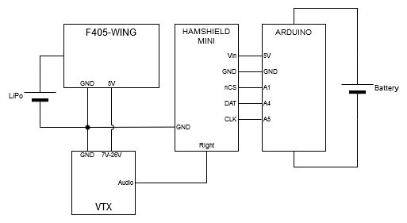

# Arduino Based Drone Telemetry
 This repository contains the framework needed to equip an Arduino and Hamshield with selectable radio tuning. By plugging in a PWM source, it is possible to adjust the frequency of the radio. In this case the source could be from a flight controller, and the audio is fed back into the FPV goggles.

 ## Getting Started
 Most of the the work getting everything to function is included. However, there are a few code changes and installations needed.
 ### Installations
 If available, download the latest Hamshield library from the library manager in your chosen IDE. If not present, it can be downloaded from the [GitHub Repo](https://github.com/EnhancedRadioDevices/HamShield).
 
 ### Code Changes
 Most of the code can stay as is if all that is needed is channel switching, but if any manual controll is needed, the autogenerated signals need to be removed:
 
 * [pwms]()
 * [pwm_out]()
 * [for loop]()
 * [analogWrite]()

 Once these are removed or adjusted as needed, plug the PWM source into pin 2. This pin is cappable of interrupts, and thus enables a few features that other pins don't. The starting frequency is defined by the [current_frequency]() variable; change this to something more suitable. The [pwm_to_frequency]() function is set up for Arduino PWM values; change these to accommodate the values provided by your source.

 ### Hardware Setup
The minimum hardware setup involves an Arduino*, Hamshield, antenna, VTX, flight controller, and battery. A generic wiring diagram can be found here:

# Acknowledgments
## Team Members
 * Bradley Spitler  - Team Lead
 * Ben Szostak - Purchasing 
 * Corey Williams - Code Maintainer
 
 ## Faculty Advisor
 * Dr. Adam Schroeder

 ## Client Advisor
 * Dr. Richard Becker
 * Dr. Henry Streby